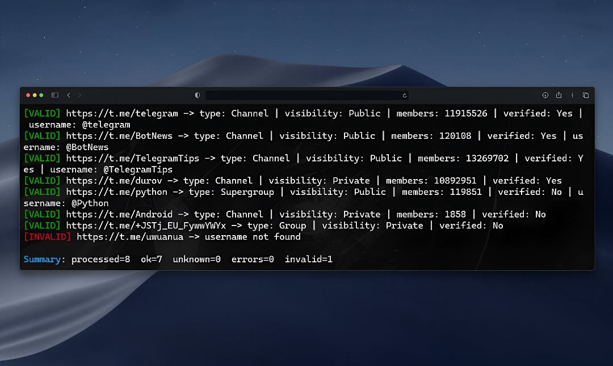

# 🔎 TELEGRAM BULK CHANNEL CHECKER

Validate Your Telegram Channels

[](https://www.python.org/downloads/) [](LICENSE)

Fast checker for Telegram invite links and public usernames. Validates inputs, classifies chat type/visibility, shows join-approval when detectable, and exports a clean CSV (valid rows only by default).

## Features

- Validate invite links and public usernames
- Detect: type (Channel / Supergroup / Group / User) and visibility (Public / Private)
- Show: members (when available), verified badge, and requires approval (request-to-join)
- Compact, colored console output
- CSV export with minimal columns (valid-only by default)

## Project Layout

```
telegram_bulk_checker.py
requirements.txt
inputs.csv
README.md
screenshot/
  preview.jpg
```

## Installation

```bash
pip install -r requirements.txt
```

## .env (required on first run)
Create a `.env` file with your Telegram app credentials (from `https://my.telegram.org`):
```
API_ID=<your_api_id>
API_HASH=<your_api_hash>
SESSION_NAME=bulk_checker
```
Do NOT commit `.env` or session files to Git.

## Usage

1) Prepare `inputs.csv`.
   - You can use a plain list (one per line) or a CSV with header `input`.
   - Examples:
     ```
     https://t.me/telegram
     @BotNews
     https://t.me/testerror1234
     ```

2) Run:
   ```bash
   python telegram_bulk_checker.py
   ```

3) Console output (compact):
   ```text
   [VALID] https://t.me/telegram -> type: Channel | visibility: Public | members: 11915542 | verified: Yes | username: @telegram
   [INVALID] https://t.me/uwuanua -> username not found
   ```

4) CSV output: `results.csv`
   - Columns: `input, kind, visibility, member_count, verified, username, requires_approval, title`
   - Only valid rows are written by default

## Configuration (optional)

- Files: `INPUT_FILE` (default `inputs.csv`), `OUTPUT_FILE` (default `results.csv`; empty to disable)
- Console: `OUTPUT_MODE` (`compact` | `minimal` | `jsonl`), `NO_COLOR=1`
- CSV: `CSV_ONLY_VALID` (`1` = only valid rows, `0` = include all)

Examples:
```bash
export OUTPUT_MODE=jsonl
export NO_COLOR=1
python telegram_bulk_checker.py
```

## Screenshots



## Output

- Console: one line per input (VALID / INVALID / UNKNOWN) with short reason for failures
- CSV: clean dataset suitable for Excel/BI (valid-only by default)

## Troubleshooting

- Missing API keys: create an app at `https://my.telegram.org` and set `API_ID` and `API_HASH` in `.env`
- First run asks for a login code (and 2FA if enabled); a local session will be saved
- If you hit rate limits, wait and retry
- Some fields (members, approval) may be unavailable depending on privacy and access

## License

MIT License — see [`LICENSE`](LICENSE).

## 👨‍💻 Author


**AxthonyV**
- GitHub: [@AxthonyV](https://github.com/AxthonyV)

## Acknowledgments ⭐

If this tool helped you, a star is appreciated.
